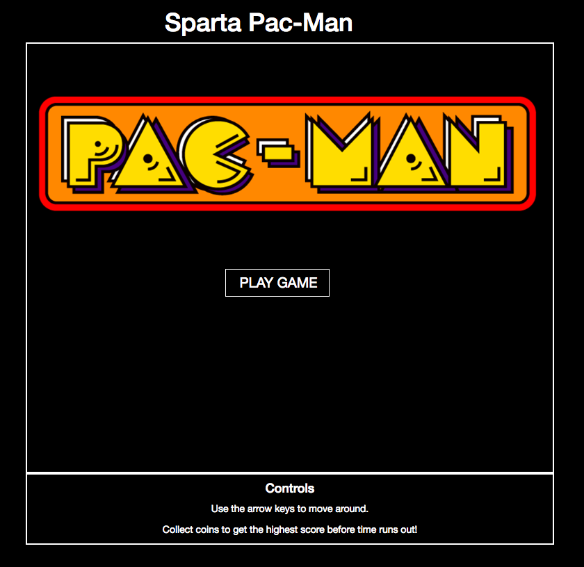
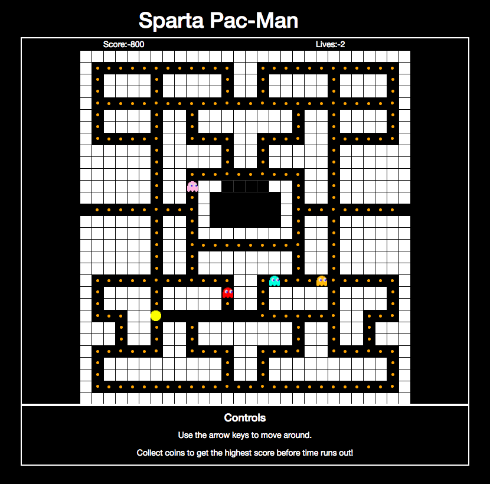
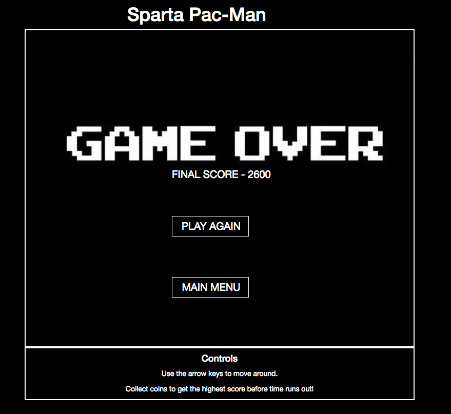

# Sparta-Core-Project-One  


## Sparta Pac-Man
Solo project to a build a game from scratch using HTML, CSS and JavaScript. Intended to mimic pac-man as closely as possible/

## Installation

Download via the zip file or by cloning the Repo from Github by clicking the green button labelled 'Clone or Download' [here](https://github.com/WCWoolley/Sparta-Core-Project-One) and open index.html in your browser. 

## Challenges

The two big sticking points for this project were collisions and movement.  

My initial method for tracking collisions was to give each wall within the maze the class name 'wall', tracking the location of each along with pac-man to constantly check when they were in contact. Now that already wasn't going to work since they would each need a seperate class to be tracked individually, as it was each wall was treated as the same wall. My next idea was to try and do exactly that, give each a seperate class but with a grid of 900 that would have been horrific to get done.  
Scrapping that I came across another method while researching which built up the whole maze based on an array, '1' would represent a wall, '2' an empty space etc. This solved the collision problem by moving thngs in single increments and redrawing the maze, an if statement in place to prevent pac-man or ghosts from moving on to a grid space with the '1' label.  

The second problem came about from building the maze like this. Everything was moving but pac-man moved once per tap and the ghosts were glitchy and erratic.  
My fitst thought was to use a while loop to manage the direction but the game consistently crashed from attempting that, it likely would have worked with tweaking but I found a method I prefered. Since the map was being updated once a second or so to track positioning I thought to use an interval to work on a set direction.  
Pac-man would continue in the direction of the previous arrow until a new one was pressed and each ghost would travel in a straight line until hitting a wall and changing direction at random.

## Code
The array I used to build out the maze:

``` Javascript
  var maze = [
    [3,3,0,3,3,3,3,3,3,3,3,8,3,3,3,3,3,3,3,3,13,3,3,3,3,3,3,3],
    [1,1,1,1,1,1,1,1,1,1,1,1,1,1,1,1,1,1,1,1,1,1,1,1,1,1,1,1],
    [1,2,2,2,2,2,2,2,2,2,2,2,2,1,1,2,2,2,2,2,2,2,2,2,2,2,2,1],
    [1,2,1,1,1,1,2,1,1,1,1,1,2,1,1,2,1,1,1,1,1,2,1,1,1,1,2,1],
    [1,2,1,1,1,1,2,1,1,1,1,1,2,1,1,2,1,1,1,1,1,2,1,1,1,1,2,1],
    [1,2,2,2,2,2,2,2,2,2,2,2,2,2,2,2,2,2,2,2,2,2,2,2,2,2,2,1],
    [1,2,1,1,1,1,2,1,1,2,1,1,1,1,1,1,1,1,2,1,1,2,1,1,1,1,2,1],
    [1,2,1,1,1,1,2,1,1,2,1,1,1,1,1,1,1,1,2,1,1,2,1,1,1,1,2,1],
    [1,2,2,2,2,2,2,1,1,2,2,2,2,1,1,2,2,2,2,1,1,2,2,2,2,2,2,1],
    [1,1,1,1,1,1,2,1,1,1,1,1,2,1,1,2,1,1,1,1,1,2,1,1,1,1,1,1],
    [1,1,1,1,1,1,2,1,1,1,1,1,2,1,1,2,1,1,1,1,1,2,1,1,1,1,1,1],
    [1,1,1,1,1,1,2,1,1,2,2,2,2,2,2,2,2,2,2,1,1,2,1,1,1,1,1,1],
    [1,1,1,1,1,1,2,1,1,2,1,1,4,4,4,4,1,1,2,1,1,2,1,1,1,1,1,1],
    [1,1,1,1,1,1,2,1,1,2,1,12,12,12,12,12,12,1,2,1,1,2,1,1,1,1,1,1],
    [6,2,2,2,2,2,2,2,2,2,1,12,9,7,10,11,12,1,2,2,2,2,2,2,2,2,2,6],
    [1,1,1,1,1,1,2,1,1,2,1,12,12,12,12,12,12,1,2,1,1,2,1,1,1,1,1,1],
    [1,1,1,1,1,1,2,1,1,2,1,1,1,1,1,1,1,1,2,1,1,2,1,1,1,1,1,1],
    [1,1,1,1,1,1,2,1,1,2,2,2,2,2,2,2,2,2,2,1,1,2,1,1,1,1,1,1],
    [1,1,1,1,1,1,2,1,1,2,1,1,1,1,1,1,1,1,2,1,1,2,1,1,1,1,1,1],
    [1,1,1,1,1,1,2,1,1,2,1,1,1,1,1,1,1,1,2,1,1,2,1,1,1,1,1,1],
    [1,2,2,2,2,2,2,2,2,2,2,2,2,1,1,2,2,2,2,2,2,2,2,2,2,2,2,1],
    [1,2,1,1,1,1,2,1,1,1,1,1,2,1,1,2,1,1,1,1,1,2,1,1,1,1,2,1],
    [1,2,1,1,1,1,2,1,1,1,1,1,2,1,1,2,1,1,1,1,1,2,1,1,1,1,2,1],
    [1,2,2,2,1,1,2,2,2,2,2,2,2,2,5,2,2,2,2,2,2,2,1,1,2,2,2,1],
    [1,1,1,2,1,1,2,1,1,2,1,1,1,1,1,1,1,1,2,1,1,2,1,1,2,1,1,1],
    [1,1,1,2,1,1,2,1,1,2,1,1,1,1,1,1,1,1,2,1,1,2,1,1,2,1,1,1],
    [1,2,2,2,2,2,2,1,1,2,2,2,2,1,1,2,2,2,2,1,1,2,2,2,2,2,2,1],
    [1,2,1,1,1,1,1,1,1,1,1,1,2,1,1,2,1,1,1,1,1,1,1,1,1,1,2,1],
    [1,2,1,1,1,1,1,1,1,1,1,1,2,1,1,2,1,1,1,1,1,1,1,1,1,1,2,1],
    [1,2,2,2,2,2,2,2,2,2,2,2,2,2,2,2,2,2,2,2,2,2,2,2,2,2,2,1],
    [1,1,1,1,1,1,1,1,1,1,1,1,1,1,1,1,1,1,1,1,1,1,1,1,1,1,1,1],
  ];
```
Partial code used to draw the maze, using values from the above array:

``` Javascript
function drawMaze(){
    document.getElementById(`Game-Window`).innerHTML = "";
    for (var i = 0; i < maze.length; i++) {
      var row = $('<tr class="row"></tr>');
      for (var j = 0; j < maze[i].length; j++) {
        if (maze[i][j] === 0) {
          var col = $(`<td class="col score">Score:-${score}</td>`).css("border","none").css("color","white")
          row.append(col);
        } else if (maze[i][j] === 1) {
          var col = $(`<td class="col wall"></td>`).css("background","white").css("border-color","black")
          row.append(col);
```
Partial code of the logic behind pac-man's movement:

``` Javascript
var pacMove = setInterval(pacMove, 320)

  // Function Loops That Starts Pac-Man Moving In Set Direction
  function pacMove() {
    if (directionPM == 1) {
      if (maze[pacman.y][pacman.x-1] ==7 || maze[pacman.y][pacman.x-1] ==9 || maze[pacman.y][pacman.x-1] ==10 || maze[pacman.y][pacman.x-1] ==11) {
        pacman.x = 14;
        pacman.y = 23;
        lives--;
        maze[pacman.y][pacman.x] = 5;
        drawMaze();
      } else if (maze[pacman.y][pacman.x-1] ==6) {
        maze[pacman.y][pacman.x] = 3;
        pacman.x = 26;
        maze[pacman.y][pacman.x] = 5;
        drawMaze();
```

## Screenshots and Links

Play the game in its current state on Github Pages, [here](https://wcwoolley.github.io/Sparta-Core-Project-One/).

**Main Menu:**
 

**Game Screen:**
 

**Game Over Screen:**
 
